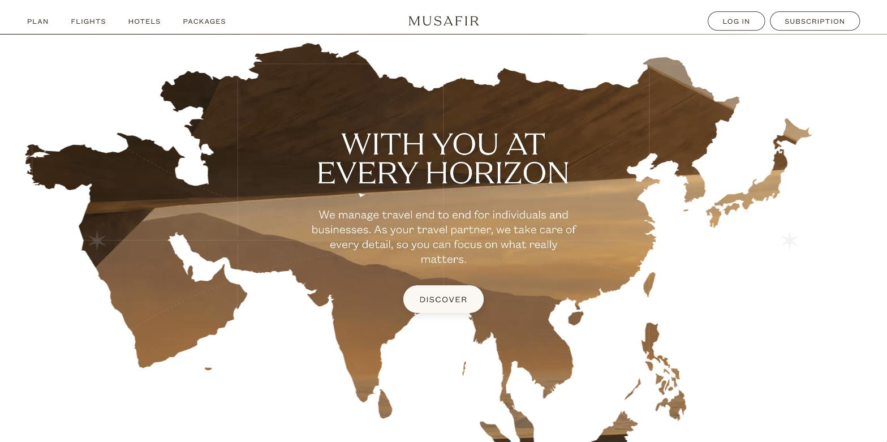
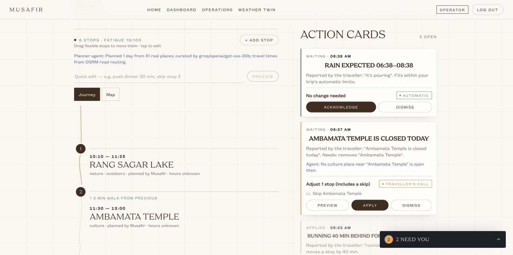
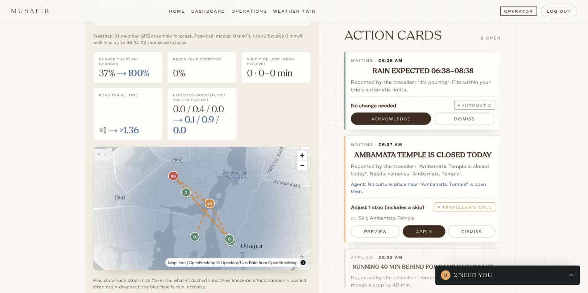
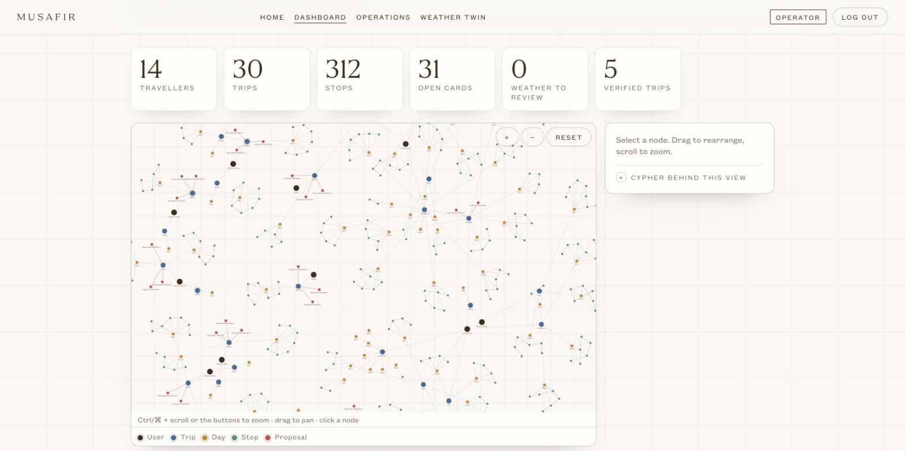
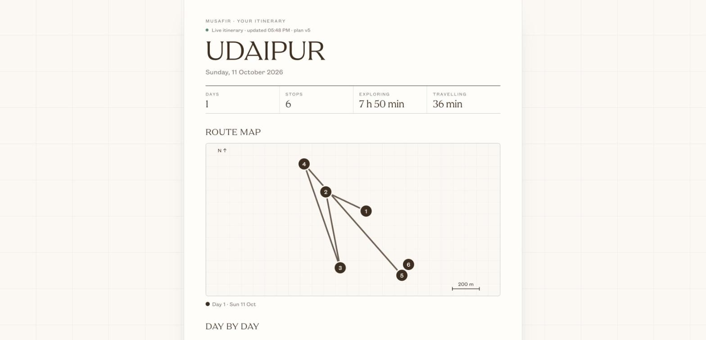
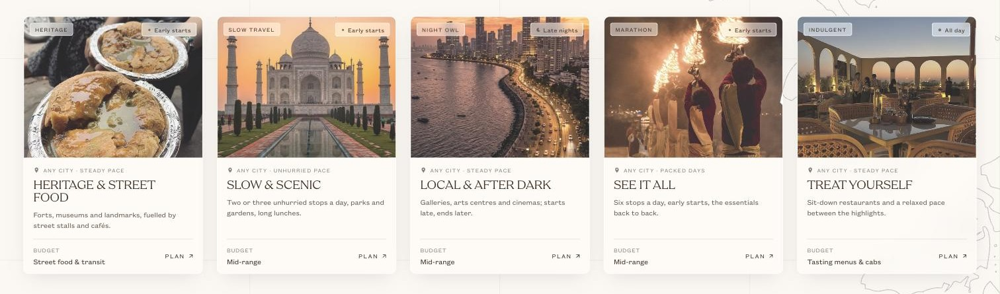
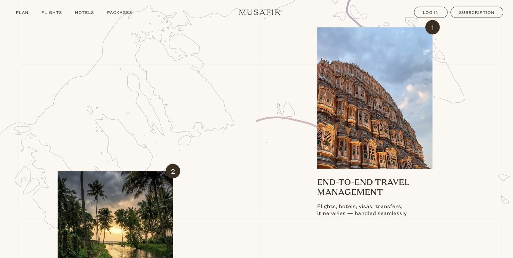
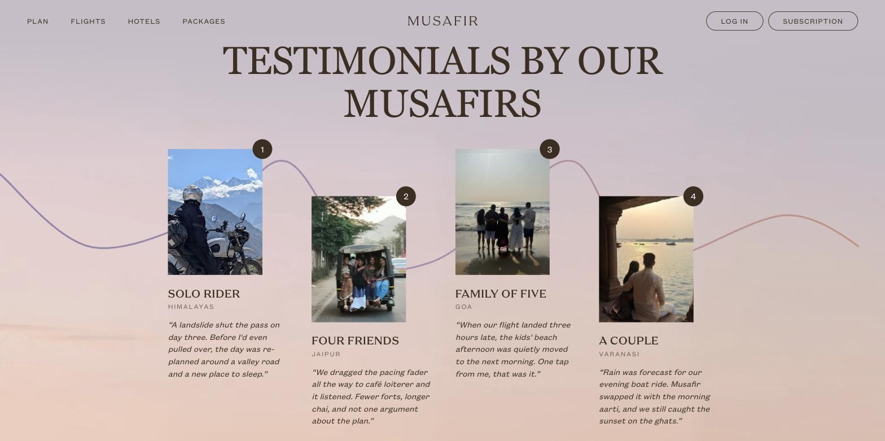
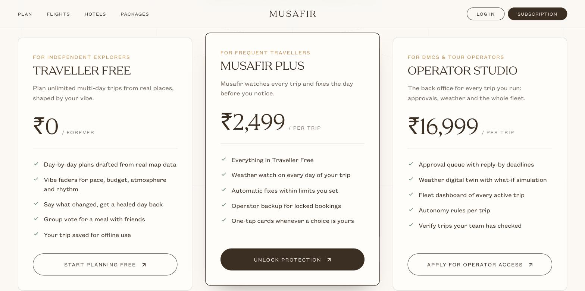
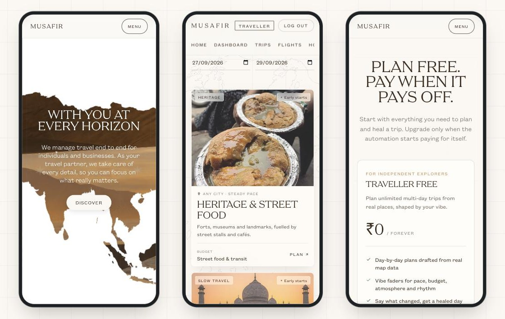

<p align="center">
  
</p>

<h1 align="center">MUSAFIR</h1>

<p align="center">
  <em>A travel companion that plans your days from real places, and quietly fixes them when the trip goes sideways.</em>
</p>

<p align="center">
  <a href="https://musafir-tan.vercel.app"><b>Open the live app</b></a>
</p>

<br>

## The idea

You set a destination, dates and a few faders for how you like to travel. Musafir drafts every day from **real places on the map**: walking distances, meal windows, and no invented venues.

Then reality happens. A train runs late, a temple is shut, rain rolls in. Musafir **heals the day on its own**: it shifts, trims or swaps stops around your locked bookings. It only asks for a tap when the change is yours to make. Anything that touches a paid booking goes to an **operator**, with a reply-by deadline.

There is **no chatbot**. Someone standing in the rain shouldn't have to type a paragraph. Instead you get faders, a live journey graph and one-tap cards.

## A look around

<table>
  <tr>
    <td width="50%"></td>
    <td width="50%"></td>
  </tr>
  <tr>
    <td><b>Trip workspace.</b> The day as a winding journey. When something breaks, a calm card arrives with the fix already worked out.</td>
    <td><b>Digital twin.</b> Try a delay or a closure first and see what it would do to the day.</td>
  </tr>
  <tr>
    <td></td>
    <td></td>
  </tr>
  <tr>
    <td><b>Operator console.</b> Every traveller, trip and pending decision across the fleet, in one graph.</td>
    <td><b>Itinerary PDF.</b> One printable page with the route map, day by day and the activity log. It stays in sync with the live plan.</td>
  </tr>
  <tr>
    <td colspan="2"></td>
  </tr>
  <tr>
    <td colspan="2"><b>Packages.</b> Each one is a travel style, not a bundle. Pick one and the planner drafts every day in that spirit.</td>
  </tr>
  <tr>
    <td></td>
    <td></td>
  </tr>
  <tr>
    <td colspan="2" align="center"><b>The landing page.</b> A route that draws itself as you scroll, torn-paper edges, and stories from the road.</td>
  </tr>
  <tr>
    <td></td>
    <td></td>
  </tr>
  <tr>
    <td><b>Subscription.</b> Planning is free. Paid tiers add automatic fixes and operator backup. Checkout runs on Stripe (test mode).</td>
    <td><b>Built for the phone.</b> A traveller on the road is holding a phone, so every screen works at phone width.</td>
  </tr>
</table>

## How it works

```
 a trigger ── your edit · a delay · a closure · rain from Open-Meteo
     │
     ▼
 trip service ── the only code that changes a trip; rejects stale versions
     │
     ├─ self-healing engine   min-cost repair between locked bookings
     ├─ disruption resolver   real venues within 800 m; the AI picks 1 of 3
     └─ planner agent         OpenStreetMap places → clustered, timed days
     │
     ▼
 checks in code ── feasibility · locked bookings · risk tier
     │
     ├─ AUTO       small shifts apply at once, with undo
     ├─ TRAVELLER  a one-tap card with a before/after preview
     └─ OPERATOR   a queue item with a reply-by deadline
     │
     ▼
 live update to every open screen (SSE)
```

**Deterministic first, AI second.** Distances, timings, costs and feasibility are plain TypeScript. The AI only chooses among places the code already fetched, and it answers with an index, so it can't invent a venue. Anything we don't know, like a price or a dietary claim, is labelled *unknown* instead of guessed.

## Built with

Next.js 16 · React 19 · TypeScript · zod · GSAP + Lenis · MapLibre · Neo4j Aura · OpenStreetMap (Nominatim + Overpass) · OSRM · Open-Meteo · Groq / Gemini (optional) · Stripe Checkout · Vercel

## Run it locally

```bash
git clone https://github.com/lakshitasethia/Musafir.git
cd Musafir
npm install
cp .env.example .env.local   # every key is optional in development
npm run dev                  # http://localhost:3000
```

`npm test` runs the core test suite in about a second (Node 22.6 or newer).

## Team

**Aryan Tanna**: core engine, agents and server · **Lakshita Sethia**: design and UI · **Parth Shah**: auditors, data and QA
