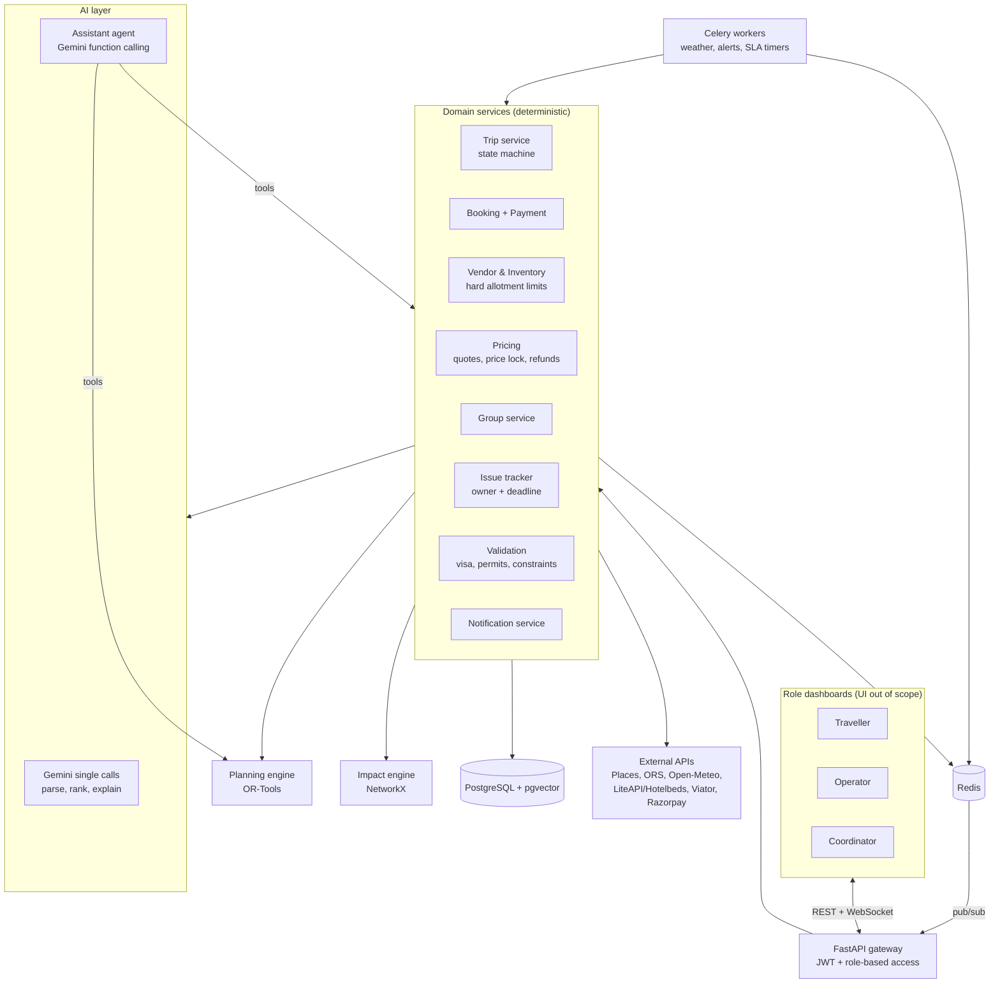

# Musafir — Research, Tech Stack & Architecture

**Problem statement:** Personalized Dynamic Tour Planning & Tour Operations Platform
**Journey:** Discover → Personalize → Plan → Price → Book → Prepare → Operate → Assist → Adapt → Complete → Review
**Scope of this doc:** research findings, final tech stack, final architecture. UI is out of scope for now. No implementation plan.

---

## 1. Design principles

1. **The LLM proposes, the solver decides.** Gemini handles language: preferences, chat, explanations. Itinerary timing, cost and feasibility come from an optimizer, so plans can't violate constraints.
2. **Deterministic backbone.** Most of the lifecycle is plain code: CRUD, pricing, payments, scheduling, state machine, event handlers. This keeps it predictable in the demo.
3. **One agent, only where it's needed.** A single tool-calling assistant handles in-trip help and disruptions (Assist + Adapt). Everything else uses single Gemini calls.
4. **Traveller, Operator and Coordinator are roles, not AI agents.** They are three dashboards with role-based access over the same data.
5. **Win on execution, not just planning.** Competitor research shows that post-booking failures are the main pain point (see §3).

---

## 2. Tech & API research findings

### 2.1 Agent framework
- **LangGraph** was evaluated. It is the common choice for multi-agent travel planners (supervisor routing, shared state, `interrupt()` for human approval, Postgres checkpoints).
- **Decision: not used.** Most of the PS is deterministic. The one agent needed can be built with Gemini's native function calling in a simple loop.

### 2.2 LLM: Gemini API
- The free tier is tight as of Sept 2026: about **20 requests/day for Flash models** and about **500/day for Flash-Lite**.
- **Decision:** route routine calls to Flash-Lite and use Flash only for final plans and explanations. Cache aggressively, and get a paid key or credits before the demo.

### 2.3 Optimization
- **Google OR-Tools** supports vehicle routing with time windows (VRPTW). A day's itinerary is modelled as one "vehicle" (the traveller) visiting POIs within their opening hours.
- **CP-SAT** (also in OR-Tools) handles assignment problems, such as coordinators or vehicles to groups.

### 2.4 Travel data APIs

| Need | Finding | Decision |
|---|---|---|
| Flights/hotels via **Amadeus** | Self-service portal **decommissioned on 17 July 2026**. Keys are disabled and sign-ups closed. Most tutorials are now broken. | ❌ Do not use |
| Hotels | LiteAPI (free sandbox); Hotelbeds APItude (sandbox; covers hotels, activities and transfers) | LiteAPI / Hotelbeds sandbox |
| Activities | Viator Basic Access: free, self-serve, sandbox key immediate. Booking endpoints need approval. | Viator Basic (discovery only) |
| POIs / places | Google Places (New) has per-SKU free caps (e.g. 10k Place Details Essentials/month) and requires a billing account | Google Places |
| Travel-time matrix | OpenRouteService free tier: 2,000 requests/day, 3,500 pairs per matrix request. Self-hosted OSRM has no cap. | ORS (OSRM as fallback) |
| Weather | Open-Meteo: free for non-commercial use, no API key, hourly forecast up to 16 days | Open-Meteo |

**Data strategy:** use real APIs for **Discover**. Use **seeded mock vendor inventory** (hotels, vehicles, activities, capacity, prices) in Postgres for **Book → Operate**. The operator side needs its own vendor records anyway, and a live demo shouldn't depend on sandbox approvals.

---

## 3. Competitor & customer review research

### 3.1 Who we looked at
- **AI trip planners:** Layla (acquired by Expedia, July 2026), Mindtrip, Wanderlog
- **Indian custom-holiday operators:** Pickyourtrail, Thrillophilia, HolidayTribe
- **Operator-side software:** Travefy, Tourwriter, Tourplan

### 3.2 What customers like
- Planning and booking in one place, without switching tabs; a human agent finalizing bookings builds trust (Layla)
- Genuinely personalized itineraries with organized planning (Pickyourtrail)
- On-trip support that is always reachable, e.g. WhatsApp (Pickyourtrail)
- Real-time group collaboration and expense splitting (Wanderlog)
- Operators: fast, polished client itineraries and live client location tracking (Travefy)

### 3.3 What customers complain about
1. **Abandoned after payment.** Fast responses before booking, then no contact before, during or after the trip (Pickyourtrail, Thrillophilia).
2. **Promised ≠ delivered.** Wrong room types, 4★ paid but 3★ given, vehicle downgrades, missing inclusions, pickup details the traveller had to ask for daily.
3. **Unvalidated plans.** A 14-day itinerary booked against a 13-day visa, missing permits, and a hotel with no lift for senior travellers.
4. **Opaque, shifting prices.** Quotes creeping upward (₹3L → ₹4.3L), no per-component refund breakdown, and no credit for skipped items.
5. **No accountability.** Bookings resold through several local operators, vague "24–72 hours" replies to complaints.
6. **AI problems.** Itineraries reordering themselves and wiping user edits, failing combined constraints ("downtown AND under $300"), different preferences producing near-identical plans, forgetting earlier instructions, chat-only editing becoming tiring.
7. **Weak during the trip.** Laggy mobile experience, and offline access paywalled (Wanderlog's #1 complaint).
8. **Operator tool gaps.** No mobile editing, manual cost totals, no auto-save (Travefy); not built for group bookings (Tourwriter). Tourplan's strength is hard inventory blocks rather than warnings.

### 3.4 Key takeaways
1. Competitors fail at **execution, not planning**. Operate, Assist and Adapt are where to stand out.
2. Treat every promise (hotel star rating, room type, vehicle, inclusions) as a **stored, verifiable field**.
3. **Push** information to travellers instead of making them ask.
4. Keep prices **transparent and stable**.
5. The AI must **respect hard constraints** and **never override user edits**.
6. Every trip component needs a **named owner and a response deadline**.
7. Travellers are shifting to **slower trips** (Thrillophilia: +14% toward fewer destinations at a relaxed pace, +42% demand for cultural/local experiences). Pace should be a real planner input.

### 3.5 What the PS already covers (baseline, not differentiators)
- Preference inputs, customization, comparing alternatives, cost estimates, optimized itinerary, booking, access to the full plan
- Operator management of customers, bookings, vendors, hotels, transport, activities, payments, groups, coordinators and schedules
- Change handling that weighs cost, availability, timing, location, dependencies and preferences
- AI for recommendations, conflict detection, alternatives and in-trip assistance
- Review stage

### 3.6 What we add (not in the PS)

| Feature | Fixes complaint |
|---|---|
| **Promise vs delivery tracking.** Any downgrade is flagged and needs traveller consent plus compensation. | #2 |
| **Proactive alerts:** day-before briefing, driver/pickup details, vouchers | #1 |
| **Pre-trip validation:** visa length vs itinerary, permits, ticket inclusions | #3 |
| **Traveller constraints:** seniors/accessibility (lift, walking load), veg/Jain diet, kids | #3 |
| **Price lock, versioned quotes, per-component refund value**, credit for skipped items | #4 |
| **Issue tickets** with owner, deadline timer, escalation, compensation log | #5 |
| **Edit locking + change history/undo.** The AI can't override manual edits. | #6 |
| **Hard constraint validation** on all AI output | #6 |
| **Offline itinerary + PDF export** | #7 |
| **Inventory limits** that block overselling | #8 |
| **Group features:** members with different preferences, cost split, individual opt-outs | Tourwriter gap |
| **Vendor reliability score** from reviews and incidents, used in recommendations and vendor choice | #5 |
| **Pace/buffer setting** as a planner input | Takeaway 7 |

**Pitch highlights:** the downgrade detector, proactive alerts, and issue tracking with deadlines. These directly answer the most repeated complaints.

---

## 4. Final tech stack

| Layer | Choice | Role |
|---|---|---|
| Language | **Python** | Whole backend |
| API | **FastAPI + Pydantic** | REST APIs, request validation, native WebSockets |
| ORM | **SQLAlchemy** | Data access |
| Database | **PostgreSQL + pgvector** | Trips, bookings, vendors, groups, issues; preference/POI similarity matching |
| Cache / queue / pub-sub | **Redis** | Caching API responses, job queue broker, real-time fan-out |
| Background jobs | **Celery** (+ Celery Beat) | Weather watcher, alert scheduling, SLA/deadline timers, vendor status checks |
| Real-time | **FastAPI WebSockets + Redis pub/sub** | Live updates to all three dashboards |
| LLM | **Gemini API**: Flash-Lite (routine), Flash (final plans/explanations) | Preference parsing, ranking, explanations, assistant |
| Agent | **Gemini function calling** (custom loop, no framework) | In-trip assistant for Assist + Adapt |
| Optimization | **Google OR-Tools**: Routing (VRPTW) + CP-SAT | Itinerary sequencing; coordinator/vehicle assignment |
| Impact analysis | **NetworkX** | Dependency graph of trip components |
| Auth | **JWT + role-based access** | Traveller / Operator / Coordinator |
| Payments | **Razorpay (test mode)** | Book stage |
| PDF export | **WeasyPrint** | Offline itinerary |
| Deployment | **Docker Compose → Render / Railway** | Hosting |

**External data:** Google Places (POIs), OpenRouteService / OSRM (travel times), Open-Meteo (weather), LiteAPI / Hotelbeds sandbox (hotels), Viator Basic (activities), plus seeded mock vendor inventory.

---

## 5. Final architecture

### 5.1 System components

### 5.2 Trip lifecycle (state machine)

`Draft → Planned → Priced → Booked → Prepared → Active → Completed → Reviewed`

Each transition is explicit code. Every change is versioned, so there is always a history to review or undo.

### 5.3 Stage-by-stage flow

| Stage | What happens | Handled by |
|---|---|---|
| **Discover** | Traveller enters destination, dates, budget, interests, style, pace and constraints (accessibility, diet). Free text is parsed into structured preferences, and matching hotels, transport and activities are ranked. | Gemini call + pgvector ranking + Places/Viator/LiteAPI |
| **Personalize** | Traveller picks, swaps or removes components and compares alternatives side by side. User edits are **locked**. | Trip service |
| **Plan** | A day-by-day itinerary is built around opening hours, travel times, pace/buffers and locked items. | OR-Tools + ORS matrix |
| **Price** | Per-component cost breakdown, budget warnings, versioned quote with price lock. | Pricing service |
| **Book** | Pre-trip validation runs (visa length, permits, inclusions, constraints). Payment is taken, inventory is decremented with hard limits, and promised specs are stored. | Validation + Booking + Razorpay |
| **Prepare** | Operator assigns a coordinator, vehicle and group. The traveller gets the full plan plus an offline PDF. | CP-SAT + Operator dashboard + WeasyPrint |
| **Operate** | Operator sees all active tours. Coordinator updates status. Proactive alerts go out (day-before briefing, driver/pickup details, vouchers). | Trip service + Celery + WebSockets |
| **Assist** | Traveller chats with the assistant agent ("find lunch nearby", "move tomorrow's trek"). | Assistant agent |
| **Adapt** | Disruption handling (see §5.4). | Impact engine + OR-Tools + Gemini + operator approval |
| **Complete** | Trip closes, and unused components are credited or refunded per component. | Pricing + Trip service |
| **Review** | Traveller rates vendors and the coordinator. Ratings and incident history update each vendor's reliability score, which feeds future recommendations. | Review + Vendor service |

### 5.4 Adapt flow (core differentiator)

1. **Event in:** cancellation, delay, weather alert (from the Celery weather watcher), vendor downgrade, or a traveller request.
2. **Impact analysis:** NetworkX walks the dependency graph (e.g. hotel → transfer → morning activity) to find the affected components.
3. **Re-plan:** OR-Tools re-solves only the affected window. Confirmed bookings and user-locked items stay fixed.
4. **Validate:** hard constraints (budget, opening hours, accessibility, availability) are checked on the new plan.
5. **Explain:** a Gemini call summarizes what changed, why, and the cost difference.
6. **Approve:** the operator approves. If it's a downgrade, the traveller must consent and compensation is logged.
7. **Propagate:** the change is versioned, and all three dashboards update instantly via WebSockets + Redis pub/sub.
8. **Track:** an issue ticket with an owner and deadline stays open until resolved.

### 5.5 Assistant agent

- **Model:** Gemini with function calling, run as a simple loop. Gemini picks a tool, the backend runs it, the result goes back, and it repeats until there is a proposal.
- **Tools:** `search_places`, `check_availability`, `get_weather`, `get_trip`, `replan_day`, `estimate_cost`, `propose_change`, `raise_issue`
- **Guardrails:** the agent can only **propose** changes. Any booking-affecting change goes through validation and operator approval. It cannot override user-locked items.

### 5.6 Where AI is used vs not

| Uses Gemini | Plain code / solver |
|---|---|
| Parsing free-text preferences | CRUD, bookings, payments |
| Ranking/recommendation reasoning | Itinerary sequencing (OR-Tools) |
| Explaining itinerary changes | Pricing, quotes, refunds |
| Assistant agent (Assist + Adapt) | Impact analysis (NetworkX) |
| | Validation, inventory limits, alerts, SLA timers |

---

## 6. Sources

**Tech & APIs**
- Amadeus self-service shutdown: https://www.phocuswire.com/amadeus-shut-down-self-service-apis-portal-developers
- Amadeus retirement evidence: https://github.com/HelpCode-ai/anythingmcp/pull/713
- LangGraph multi-agent travel planner example: https://github.com/MrSamarjitBanerjee/ai-trip-planner
- OR-Tools VRPTW: https://developers.google.com/optimization/routing/vrptw
- Route optimization tools overview: https://www.altexsoft.com/blog/how-to-solve-vehicle-routing-problems-route-optimization-software-and-their-apis/
- Travel APIs 2026 (Hotelbeds): https://api.market/blog/magicapi/travel-api/best-travel-apis-for-developers
- LiteAPI: https://nuitee.com/connect/liteapi-build
- Viator API access levels: https://github.com/api-evangelist/viator
- Open-Meteo: https://github.com/open-meteo/open-meteo
- OpenRouteService limits: https://glama.ai/mcp/servers/ni-c/osm-mcp/tree , https://ask.openrouteservice.org/t/matrix-api-3500-route-limit/5331
- Google Maps free tiers: https://www.woosmap.com/blog/is-google-maps-api-free
- Gemini free tier limits: https://www.scriptbyai.com/gemini-api-free-tier-limits/

**Competitors & reviews**
- Pickyourtrail: https://www.trustpilot.com/review/pickyourtrail.com , https://au.trustpilot.com/review/pickyourtrail.com , https://uk.trustpilot.com/review/pickyourtrail.com?page=6 , https://apps.apple.com/in/app/pickyourtrail-travel-planner/id1400253672
- Thrillophilia: https://www.trustpilot.com/review/www.thrillophilia.com , https://ie.trustpilot.com/review/www.thrillophilia.com?page=6 , https://ca.trustpilot.com/review/www.thrillophilia.com?page=3 , https://www.holidify.com/travel-agent-details/thrillophilia-travel-solutions-private-limited-83993/ , https://www.tripadvisor.in/ShowTopic-g293860-i511-k9378809-Thrillophilia_reviews-India.html , https://www.cbinsights.com/company/thrillophilia-adventure-tours
- Layla: https://www.trustpilot.com/review/layla.ai , https://au.trustpilot.com/review/layla.ai , https://www.endlesstravelplans.com/guides/planning-tools/layla-ai-review
- Mindtrip: https://www.producthunt.com/products/mindtrip/reviews , https://www.afar.com/magazine/we-tested-ai-travel-planning-apps-here-are-the-3-that-actually-worked , https://voyaige.to/blog/best-ai-travel-planner-2026
- Wanderlog: https://www.appstory.org/blog/comprehensive-app-review-wanderlog-trip-planner-app/ , https://apps.apple.com/us/app/wanderlog/id1476732439
- Travefy: https://www.capterra.com/p/148927/Travefy-Agent/reviews/ , https://www.itqlick.com/travefy-agent
- Tourwriter / Tourplan: https://www.bokun.io/tourwriter-reviews , https://www.tourwriter.com/tourplan-reviews-alternatives/
